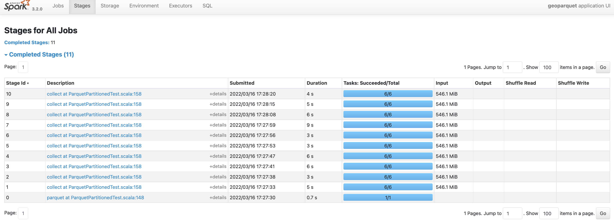
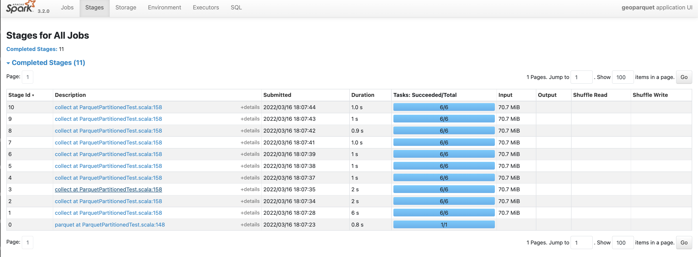
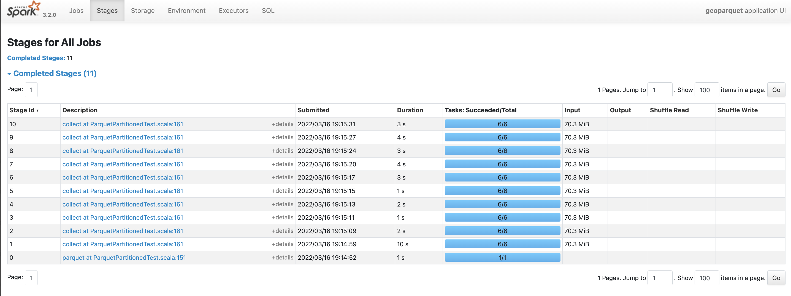
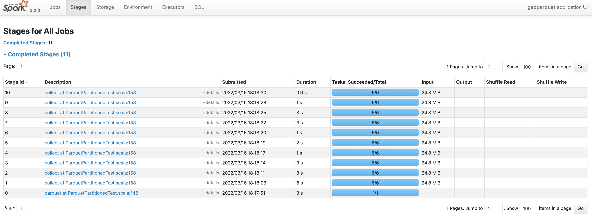
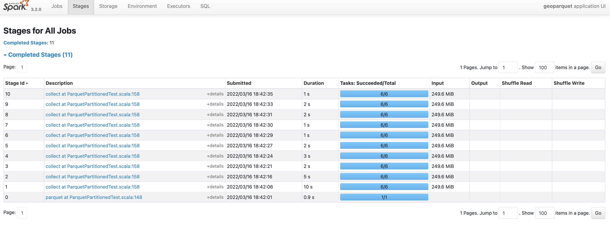

## GeoParquet // impact of the block size, partitioning and sorting on the GIS queries

The initial dataset is GADM lvl2.csv a 1.5 GBs CSV file of features. TODO: Ask Eugene more about the specifics of the data/

Parquet is a columnar format that supports filtering push down. Every parquet column is split into a row group,
and on write Parquet file writers may aggregate per row group statistics (i.e. min / max column values within the row group), 
which can be used for the push down filtering. Filters in this case may skip blocks that are not within the query range. 

This document will demonstrate how the internal parquet data structure may impact range queries performance.

The BBOX query used in all cases is: 

```bash
xmin = 7.02439457
xmax = 7.93392696
ymin = 46.42925416
ymax = 47.19834404
```


**No partitioning, no sorting, block size >= 64m, 1 row group**


**No partitioning, no sorting, block size = 16m, 1-3 row groups**


**No partitioning, no sorting, block size = 4m, ~10+ row groups**


**No partitioning, no sorting, block size = 0.01m, ~30+ row groups**

<!-- 
**No partitioning, no sorting, block size = 0.001m, ~30+ row groups**


**Spatial partitioning, sorting, block size = 0.001m, ~30+ row groups** -->


**Spatial partitioning, sorting, block size = 0.01m, ~30+ row groups**


**Spatial partitioning, sorting, block size = 0.01m, ~30+ row groups, dropped unused columns (double checked that it works as expected)**


**Spatial partitioning, sorting, block size = 4m, ~10+ row groups**


**Spatial partitioning, sorting, block size = 16m, 1-3 row groups**

**NOTE: for this dataset, split into 0.001m blocks didn't work, since the 0.01m turned out to be the min possible row group size. Alignment?**